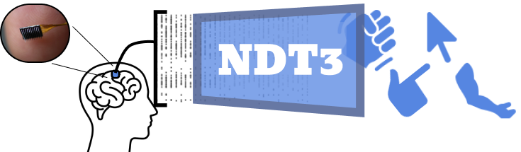

# Neural Data Transformer 3: A Foundation Model for Motor BCI


This is a repo for training and running inference on NDT3 models, including use of pretrained NDT3 models.

## Setup

These setup instructions were written for a Linux environment. Please contribute instructions for other platforms via a pull request.

### Environment Setup
Setting up the virtual environment for NDT3 requires several steps due to Flash-Attention dependencies:

```
conda create --name torch2 python=3.11
conda activate torch2
pip install -e . --extra-index-url https://download.pytorch.org/whl/cu118
pip install flash-attn --no-build-isolation
```

### Hardware Requirements
NDT3 is optimized for training with bfloat16 and utilizes FlashAttn 2, which requires NVIDIA GPUs with Ampere architecture or newer. Limited functionality may be possible on older GPUs by downgrading to flash-attention 1.0.9, but pretrained models will not be compatible.

### Data Setup
Datasets and checkpoints should be placed in the `./data` directory. Specific dataset locations for training should be declared in the `context_registry`.

To install public evaluation datasets mentioned in the manuscript, execute the following command:
```bash
./data_scripts/install_ndt3_eval_datasets.sh
```

To declare a new dataset, it must be registered into the codebase in several steps:
- Add the dataset to `context_registry.py`
- Create per-dataset information such as `task`, `subject`, `config` # TODO revise this
- Write a data preprocessing script, following the pattern of existing ones in `context_general_bci/tasks`.
- Create an experimental config that uses this dataset under `context_general_bci/config/exp/`.

### Experiment Tracking
Experiment tracking is done with Weights and Biases, so you must setup a wandb account before runs are launched. ([WandB Quickstart](https://docs.wandb.ai/quickstart/)). Once this setup is done, adjust the `wandb_user` and `wandb_project` in `config_base` or your experimental configs.

### Pretrained Checkpoints
Pretrained checkpoints corresponding to `v5/base_45m_200h` and `v5/big_350m_2kh` are available on [HuggingFace](https://huggingface.co/joel99/ndt3). These can be installed anywhere; to fine-tune a pretrained model, your configs should set `init_ckpt` to the exact checkpoint path.


## Training and evaluating a model

The following sections describe how to train and evaluate a model from-scratch or fine-tune a pretrained model. A minimal example is provided in `examples/finetuning.ipynb`.

### Training from-scratch
Models are trained or fine-tuned according to experimental configurations. Example configurations can be found in `./context_general_bci/config/exp/`. The configuration system is based on [Hydra](https://hydra.cc/), allowing for modular specification of parameters. The full configuration is composed by combining with `context_general_bci/config/config_base.py`. Fine-tuning also shares this config system, with the only difference being that fine-tuned configs must declare the models they inherit, using one of several mechanisms, explained in the next section.

To initiate a training run, use the following command:
```bash
python run.py +exp/<EXP_SET>=<exp>
```
For example, to run the experiment configured in `context_general_bci/config/exp/v5/rtt/smoketest.yaml`:
```bash
python run.py +exp/v5/rtt=smoketest
```

Additional features:
- Experiment tracking is done with Weights and Biases, so you must setup a wandb account before runs are launched. ([WandB Quickstart](https://docs.wandb.ai/quickstart/)). Once this setup is done, adjust the `wandb_user` and `wandb_project` in `config_base` or your experimental configs.
- SLURM job scripts are available in the `slurm` directory.
- Basic random search and grid sweeps of hyperparameters are implemented via `hp_sweep_space`.

### Fine-tuning
Several mechanisms in this codebase enable model inheritance. For starters:

- `init_ckpt`: Path of checkpoint to load.
- `inherit_exp` and `inherit_tag`: The most extensively used combination in this codebase. These two settings query your Weights and Biases workspace, looking for recent runs with configs declared in the folder specified by `inherit_exp` and the filename declared by `inherit_tag`. In `run.py`, these two tags yield a local ckpt path and write into `init_ckpt`.

See `config_base` for other potential fine-tuning options. Note model inheritance assumes a large level of consistency in many aspects of the model, e.g. same Transformer dimensions. Some configs can be changed under fine-tuning, which is declared in `model.transfer_cfg`.

## Troubleshooting

### Packaging Error
If you encounter a packaging error, try:
```bash
python -m pip install setuptools==69.5.1
```
For more information, see [this issue](https://github.com/pytorch/serve/issues/3176).

### NVCC Not Available
If you receive an error indicating NVCC is not available, refer to [this issue](https://github.com/Dao-AILab/flash-attention/issues/509) for potential solutions.

### Torch Compilation Error
If you encounter a `stdlib.h: No such file or directory` error during torch compilation, ensure you have the necessary build dependencies:
```bash
sudo apt-get install build-essential
```
<!-- This is a GCC issue, I think, but GCC is available. -->

### Error launching run.py
```bash
 assert config.model.transformer.max_trial_length >= config.dataset.max_trial_length, \
           ^^^^^^^^^^^^^^^^^^^^^^^^^^^^^^^^^^^^^^^^^^^^^^^^^^^^^^^^^^^^^^^^^^^^^^^^^^^^
AssertionError: max_trial_length 250 in model must exceed that served by dataset 1500
```
This error occurs when Hydra fails to load in a config file because it does not recognize the path you provided. e.g. your `python run.py **+exp/path/to/config_dir=config_file**` is misformatted. If pointed to a file that does not exist, Hydra will simply no-op (as though you ran `python run.py`), which triggers this bad assert.
